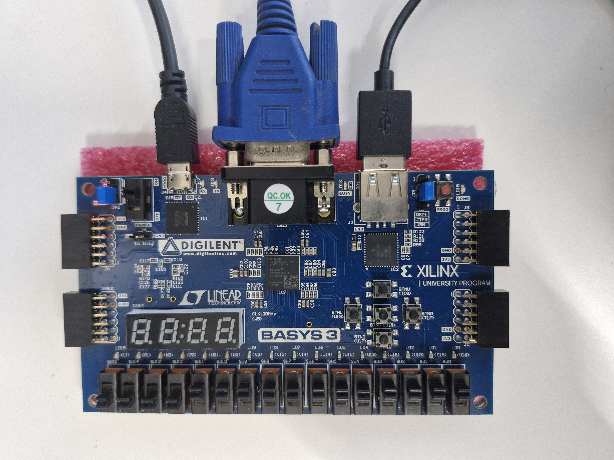

# Nand2Tetris: FPGA implementation

This project develops a hardware for a computer based on [Nand2Tetris](https://www.nand2tetris.org) course on building a computer from first principles. 
The Basys 3 board used is used to implement logic circuit and verilog language is used for implementing circuits.

In addition to regular Nand2Tetris course here keyboard and VGA display interfaces are implemented directly on hardware (using verilog) to provide same functionality as there in Nand2Tetris simulator.

# How to run Pong Game

1. Create vivado project by selecting basys 3 board.

2. Right click on "Design Sources" and select "Add Sources...". 

3. Then select "Add or create design sources" and click "Next". 

4. Select "Add Directories" and choose "n2t_pong_game" and click "Finish".

5. Right click on "Constraints" 
and select "Add Sources...". 

6. Select "Add or create constraints" and select next.

7. Select "Add Files" and select the constraints file  "n2t_computer.xdc" available at "04/n2t_pong_game/n2t_pong_game_new.srcs/constrs_1/new/n2t_computer.xdc" and click "Finish".

8. Now perform "Run Synthesis" &rarr; "Run Implementation" &rarr; "Generate Bitstream"

9. Connect keyboard and monitor (at VGA port) to Basys board, and Basys board to PC.

10. Select "Open Hardware" &rarr; "Open Target" &rarr; "Auto Connect" &rarr; "Program Device". Bitsream file that is shown in window are often correct so just click on "Program". 

Hope the game is running :fire:.

Check on [Youtube](https://youtu.be/c2e3QnLzx_o?feature=shared)